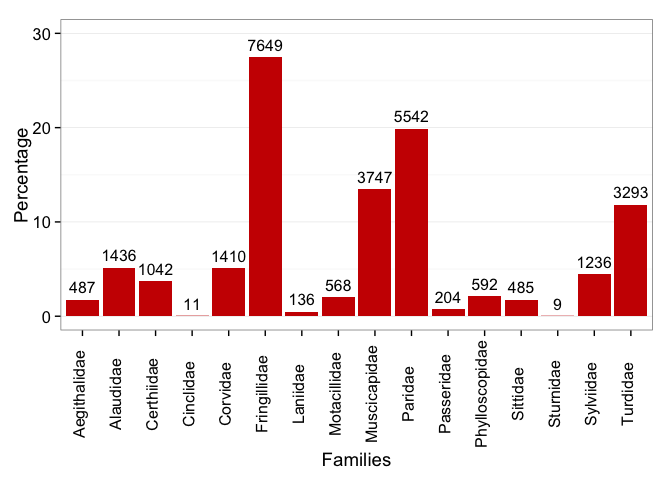
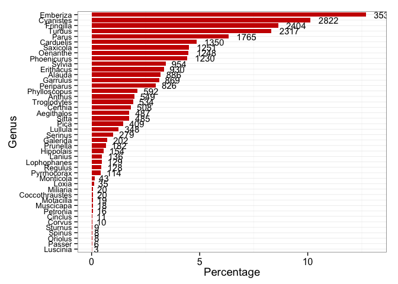

Create taxonomic coverage graphs
================================

Family graphs
-------------



    ## quartz_off_screen 
    ##                 2

    ## quartz_off_screen 
    ##                 2

Genus graphs
------------

``` r
# genus_passeri<- read.csv(file = paste(di,"/data/genus_passeri.csv", sep="") )


# genus_passeri$Genus <- reorder(genus_passeri$Genus, genus_passeri$records)

genero$genus <- reorder(genero$genus, genero$n_records)

ge <- ggplot(data=genero, aes(x=genus, y=per)) +
  geom_bar(stat="identity", fill='#CC0000', width=.8) + 
  coord_flip()+
  xlab("Genus") + ylab("Percentage") +
  geom_text(aes(label = n_records, y = per), hjust=-0.4 , size = 4) + 
  theme_bw() + ylim(c(0,13))+
  theme(panel.grid.major.x= element_blank(),
        axis.title = element_text(size = 14),
        axis.text.x= element_text(size = 12))
ge
```



``` r
jpeg(filename = paste(di,'/figures/plot_genus_passeri.jpg',sep=""), width = 800, height = 600)
plot(ge)
dev.off()
```

    ## quartz_off_screen 
    ##                 2

``` r
pdf(paste(di,'/figures/plot_genus_passeri.pdf',sep=""), width = 12, height = 8)
plot(ge)
dev.off()
```

    ## quartz_off_screen 
    ##                 2

``` r
# # Reorder the Genus column levels to records-sorted order.
# 
# genero$Genus <- reorder(genero$Genus, genero$records)
# 
# # Increase the font size of the y-axis tick labels
# 
# g <-  ggplot(genero, aes(x=Genus, y=per)) + 
#       geom_bar(stat='identity',  fill='#666699') +
#       coord_flip()+
#       theme_bw()+
#       geom_text(aes(label = records, y = per), hjust=-0.3, size = 3.5) +
#       labs (y = "% records" , x ="Genus") +
#       theme(axis.text.y=element_text(size=rel(1)),
#         axis.title = element_text(size = 14))
#   
# g
# 
# jpeg(filename = paste(di,'/figures/plot_genero.jpg',sep=""), width = 800, height = 600)
# plot(g)
# dev.off()
#    
# ## Hay mucho hueco entre los géneros y las barras?
#    
#    
```

``` r
# families_passeri<- read.csv(file = paste(di,"/data/familes_passeri.csv", sep="") )
# 
# # Reorder the Families column levels to records-sorted order.
# 
# families_passeri$Families <- reorder(families_passeri$Families, families_passeri$records)
# 
# pa <- ggplot(data=families_passeri, aes(x=Families, y=per)) +
#   geom_bar(stat="identity", fill='#CC0000') + 
#   xlab("Families") + ylab("Percentage") +
#   geom_text(aes(label = records, y = per), vjust=-0.6 , size = 4.2) + 
#   theme_bw() + ylim(c(0,30))+
#   theme(panel.grid.major.x= element_blank(),
#         axis.title = element_text(size = 14, vjust= -0.5),
#         axis.text.x= element_text(size = 12, angle=90),
#         axis.text.y=element_text(size=rel(1.3)))
# pa
# 
# 
# jpeg(filename = paste(di,'/figures/plot_families_passeri.jpg',sep=""), width = 800, height = 600)
# plot(pa)
# dev.off()
# ```
# 
# ## Graphs of Genus by Order Passeriformes
# 
# ```{r}
# genus_passeri<- read.csv(file = paste(di,"/data/genus_passeri.csv", sep="") )
# 
# # Reorder the Families column levels to records-sorted order.
# 
# genus_passeri$Genus <- reorder(genus_passeri$Genus, genus_passeri$records)
# 
# ge <- ggplot(data=genus_passeri, aes(x=Genus, y=per)) +
#   geom_bar(stat="identity", fill='#CC0000') + 
#   coord_flip()+
#   xlab("Genus") + ylab("Percentage") +
#   geom_text(aes(label = records, y = per), hjust=-0.4 , size = 4) + 
#   theme_bw() + ylim(c(0,13))+
#   theme(panel.grid.major.x= element_blank(),
#         axis.title = element_text(size = 14),
#         axis.text.x= element_text(size = 12))
# ge
# 
# jpeg(filename = paste(di,'/figures/plot_genus_passeri.jpg',sep=""), width = 800, height = 600)
# plot(ge)
# dev.off()
```
