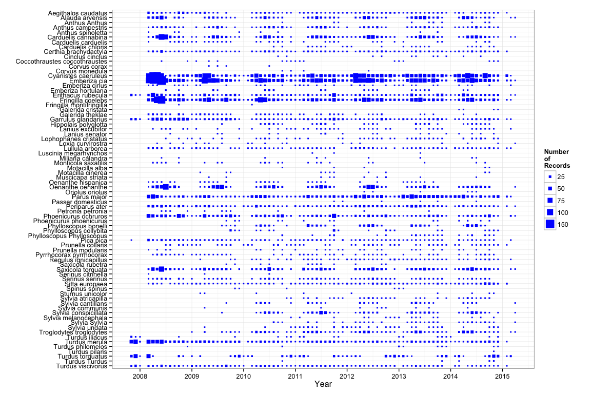

Create a plot with records vs. time by species
==============================================

``` r
# Set wd 
machine <- 'ajpelu'

di <- paste('/Users/', machine, '/ownCloud/MS/MS_DP_DISPERSANTES/dp_dispersantes', sep='')

# Read data
df <- read.csv(file=paste(di,"/data/dicc_dwc/ocurrences.csv", sep=""), header=TRUE, sep=";")
```

``` r
library('dplyr')
```

    ## 
    ## Attaching package: 'dplyr'
    ## 
    ## The following object is masked from 'package:stats':
    ## 
    ##     filter
    ## 
    ## The following objects are masked from 'package:base':
    ## 
    ##     intersect, setdiff, setequal, union

``` r
library('ggplot2')
library('scales')
library('zoo')
```

    ## 
    ## Attaching package: 'zoo'
    ## 
    ## The following objects are masked from 'package:base':
    ## 
    ##     as.Date, as.Date.numeric

``` r
# Create a variable with only scientific name
df$nombre_cientifico <- paste(df$genus, df$specificepithet, sep=" ")

# Create a subset. 
# Number of records by month and year 

df1 <- df %>% 
  select(year, month, day, eventdate, nombre_cientifico, ocurrenceid) %>% 
  mutate(count=1) %>% 
  mutate(fecha = as.Date(as.yearmon(paste(year,month, sep='-'), format='%Y-%m'))) %>%
  group_by(nombre_cientifico, fecha) %>% 
  summarise(numero=length(nombre_cientifico))


# Change order (allphabetically) to improve the plot
df1 <- within(df1, 
              nombre_cientifico_ord <- ordered(nombre_cientifico, levels=rev(sort(unique(nombre_cientifico)))))
```

``` r
p <- ggplot(df1, aes(fecha, nombre_cientifico_ord)) + 
  geom_point(aes(size=numero), col='blue') + 
  scale_size_continuous('Number\nof\nRecords', breaks=c(25,50,75,100,150))+
  theme_bw() + scale_x_date(labels=date_format("%Y"), breaks = '1 year') +
  xlab('Year') + ylab('')

p 
```



``` r
tiff(filename = paste(di,'/figures/plot_time_records.tiff',sep=""), width = 1000, height = 1200)
plot(p)
dev.off()
```

    ## pdf 
    ##   2
